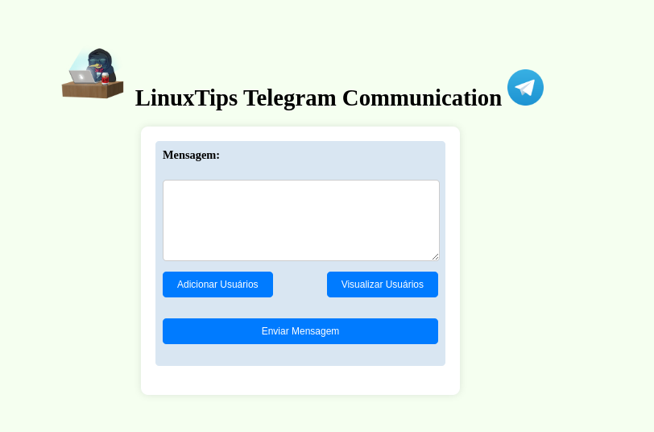

# LinuxTips Telegram Communication
Criei esse Script com o intuíto de permitir que consigamos mandar mensagens privadas para os alunos através do Telegram. Como o Telegram não permite o envio de mensagens privadas através de um bot a menos que o **usuário destino** já tenha conversado com o bot algumas vez, precisaremos de um usuário real no Telegram para realizar esse trabalho
Antes de tudo, clone esse repositório localmente

        git clone git@github.com:FabioBartoli/Linuxtips-telegram-communication.git 

 1. Assim que tivermos logado no usuário do Telegram, iremos acessar o link https://my.telegram.org/ e acessar a opção "[API development tools](https://my.telegram.org/apps)"

 2. Nessa tela, iremos preencher um "App title" e um "Short name" para a aplicação do nosso usuário, e vamos copiar o "api_id" e "api_hash"
 
 
 
 3. Iremos preencher esses dados no arquivo config.json, presente na raiz do repo
 4. Durante a primeira execução, precisaremos gerar o arquivo do Telegram onde ficam salvas as configurações da conta que o código irá se comunicar (o arquivo *session_name.session*), para isso será necessário executar o python localmente:

        pip  install  --no-cache-dir  -r  requirements.txt
        generate-config.py
O Terminal irá pedir por algumas informações, passe conforme o usuário que está sendo configurado:

5. Agora que o arquivo existe, podemos fazer o build da imagem docker para jogar todo o conteúdo da aplicação para dentro do container.

        docker build -t telegram-bot .

6. Com a imagem buildada, podemos startar o container com o comando abaixo:

        docker run --name telegram-bot -p 5000:5000 -v ./data:/opt/app/data telegram-bot

Por fim, ao acessar http://127.0.0.1:5000/ | http://localhost:5000/ , poderemos ver a aplicação em execução

## Breve explicação sobre o funcionamento do código
No Dockerfile, estou construindo a aplicação utilizando o Alpine Python como imagem base e instalando o Redis no container que irá executar a aplicação. O Redis é responsável por armazenar os nomes de usuário que digitamos na aplicação
Como por padrão o Redis não armazena dados em storage mas apenas na memória, eu estou pedindo para ele criar um dump a cada minuto, quando houver pelo menos uma alteração, através do arquivo redis.conf:

    save 60 1
    dir /opt/app/data
Através do Dockerfile, digo para o redis-server utilizar o arquivo que estou copiando para dentro do container:

Durante o run do container, passo a minha pasta local ./data para ser montada dentro do container no caminho /opt/app/data, para que os dados não sejam perdidos quando o container morrer

#### Qualquer dúvida, não deixe de entrar em contato pelo Telegram: [@FabioBartoli](https://t.me/FabioBartoli)

#VAIIII